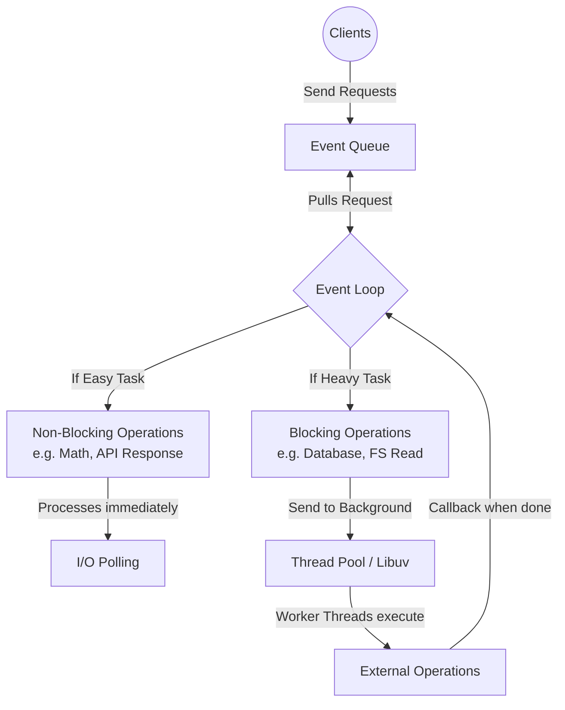

# Node.js Architecture Diagram

> **Bhai, jab aap is file ko GitHub par khologe, toh niche wala code automatic ek bohot mast Visual Image (Diagram) me badal jayega!** Text wala jhanjhat khatam.

```mermaid
graph TD
    Client((Clients)) -->|Send Requests| Queue[Event Queue]
    Queue <-->|Pulls Request| Loop{Event Loop}
    
    Loop -->|If Easy Task| NonBlock[Non-Blocking Operations <br> e.g. Math, API Response]
    NonBlock -->|Processes immediately| IOPolling[I/O Polling]
    
    Loop -->|If Heavy Task| Block[Blocking Operations <br> e.g. Database, FS Read]
    Block -->|Send to Background| ThreadPool[Thread Pool / Libuv]
    ThreadPool -->|Worker Threads execute| ExtOp[External Operations]
    ExtOp -->|Callback when done| Loop
```
